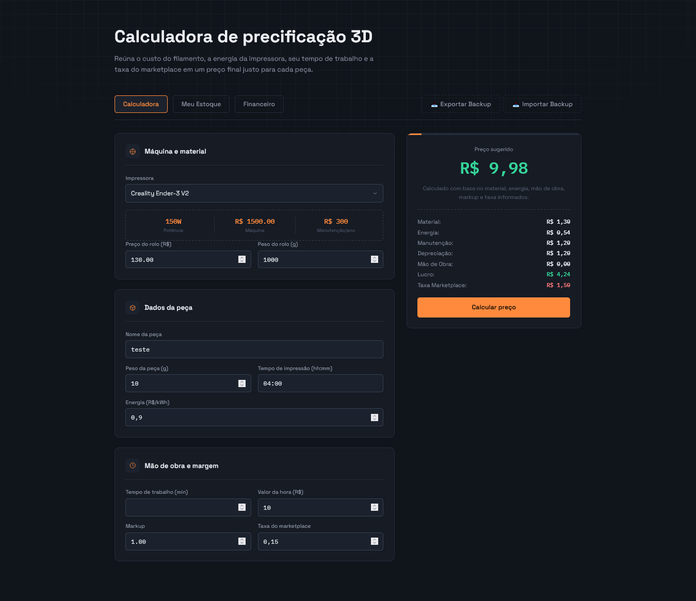
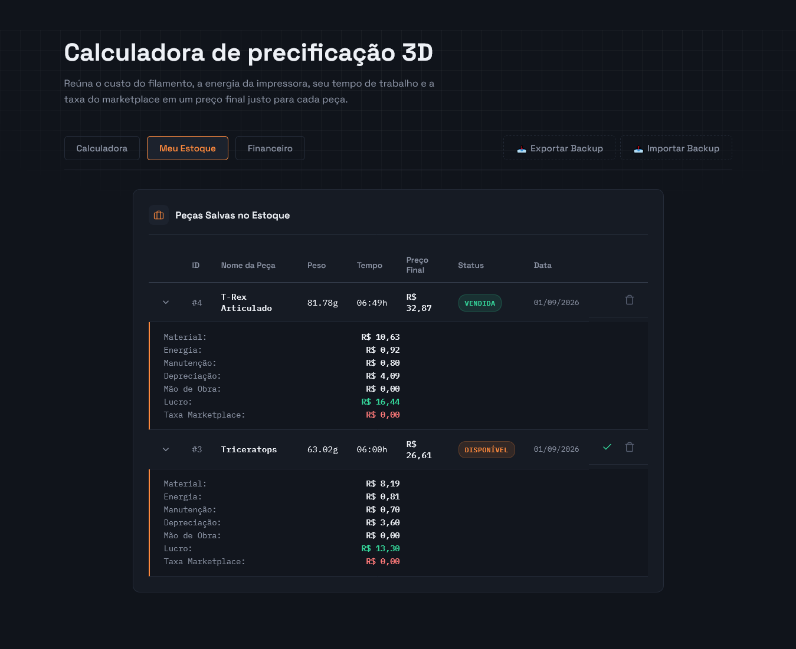
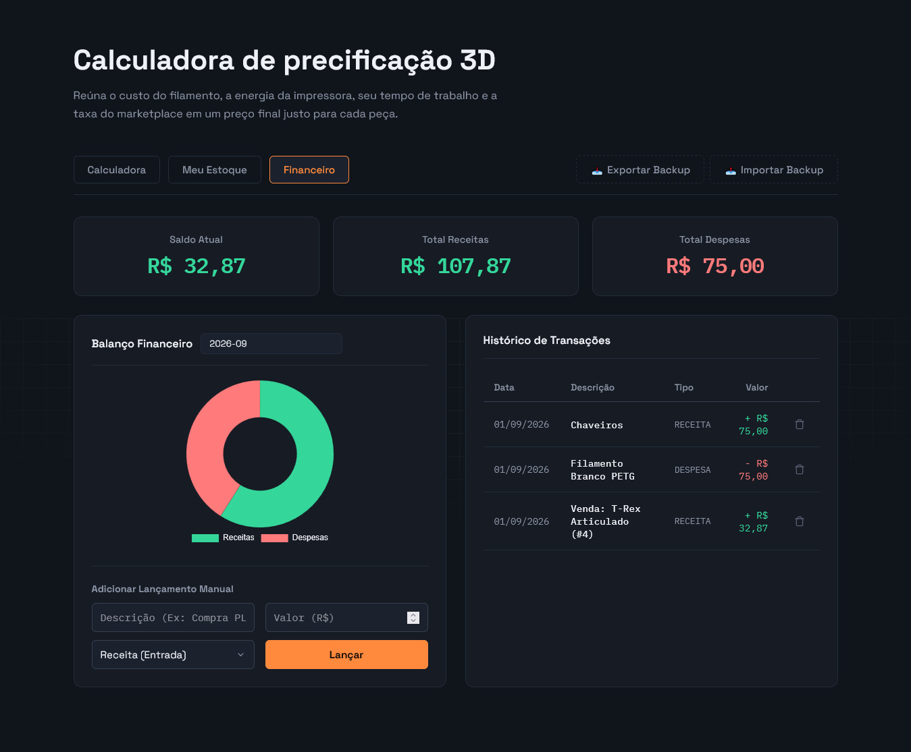

# 🖨️ Mini-ERP 3D — Sistema de Precificação e Gestão


> **Mini-ERP 3D** é um sistema de código aberto desenvolvido para facilitar a **precificação, gestão de estoque e controle financeiro** de negócios que trabalham com impressão 3D.

O sistema combina uma calculadora de custos de fabricação, considerando material, energia, manutenção, depreciação e tempo. Com gerenciamento de estoque e um dashboard financeiro.

---

## ✨ Funcionalidades

### 🧮 Calculadora de Precificação Avançada

- Cálculo detalhado dos custos de fabricação:
  - 🧵 Filamento
  - ⚡ Energia elétrica (kWh)
  - 🖨️ Depreciação da máquina
  - 🔧 Manutenção anual
  - 👷 Mão de obra
- Inclusão de **valor da mão de obra por hora**.
- Cálculo de **taxas de marketplaces**, como Shopee e Mercado Livre.
- Input intuitivo do tempo de impressão utilizando máscara `hh:mm`.
- Conversão automática do tempo de impressão para horas decimais.
- Cálculo do preço de venda e margem de lucro.

### 📦 Gestão de Estoque

- Salvamento de orçamentos diretamente no estoque.
- Controle de peças produzidas.
- Status dinâmico das peças:
  - 🟢 `Disponível`
  - 🔴 `Vendida`
- Linhas expansíveis na tabela para consultar o detalhamento dos custos.
- Visualização dos dados utilizados na precificação de peças antigas.
- Sistema de backup completo do banco de dados.
- Importação e exportação dos dados em formato `JSON`.

### 📊 Dashboard Financeiro

- Integração automática entre **Estoque** e **Financeiro**.
- Ao marcar uma peça como `Vendida`, o valor da venda é automaticamente registrado como **Receita**.
- Gráfico financeiro interativo em formato de rosca utilizando **Chart.js**.
- Cadastro manual de lançamentos financeiros.
- Possibilidade de registrar despesas, como:
  - Compra de filamentos
  - Insumos
  - Manutenção
  - Outros custos operacionais
- Filtro de balanço financeiro por:
  - Mês
  - Ano
- Histórico completo de transações.
- Operações de CRUD sobre os lançamentos financeiros.

---

## 🏗️ Arquitetura do Sistema

O projeto utiliza uma arquitetura baseada em **Spring Boot**, separando as responsabilidades entre as principais camadas da aplicação:

```text
Frontend
   │
   │ HTTP / REST API
   ▼
Controllers
   │
   ▼
Services
   │
   ▼
Repositories
   │
   ▼
PostgreSQL
```

### Backend

O backend é responsável por:

- Regras de negócio.
- Cálculos de precificação.
- Persistência dos dados.
- Validação das requisições.
- Gerenciamento de estoque.
- Controle financeiro.
- Exposição da API REST.
- Tratamento global de exceções.

### Frontend

O frontend é responsável por:

- Interface gráfica.
- Interação com o usuário.
- Consumo da API REST.
- Atualização dinâmica das informações.
- Exibição dos gráficos financeiros.

---

## 🛠️ Tecnologias Utilizadas

### Backend

- **Java 21**
- **Spring Boot 3.3.3**
  - Spring Web
  - Spring Data JPA
  - Spring Validation
- **Hibernate**
  - Mapeamento Objeto-Relacional (ORM)
- **Global Exception Handler**
  - Tratamento estruturado de erros
  - Tratamento de erros de validação
- **REST API**

### Frontend

- **HTML5**
- **CSS3**
  - Dark Mode
  - Layout responsivo
- **JavaScript Vanilla**
  - Fetch API
  - Manipulação assíncrona do DOM
- **Chart.js**
  - Visualização dos dados financeiros

### Banco de Dados e Infraestrutura

- **PostgreSQL**
- **Maven**
- **Fat JAR**
- **Script Batch (`.bat`)**
  - Inicialização simplificada do sistema
  - Execução sem necessidade de abrir uma IDE

---

## 📁 Estrutura do Projeto

Uma estrutura aproximada do projeto:

```text
Mini-ERP-3D/
│
├── src/
│   └── main/
│       ├── java/
│       │   └── com/
│       │       └── hsprints3d/
│       │           ├── controller/
│       │           ├── exception/
│       │           ├── model/
│       │           ├── repository/
│       │           └── service/
│       │
│       └── resources/
│           ├── static/
│           │   ├── css/
│           │   ├── js/
│           │   └── ...
│           │
│           └── application.properties
│
├── docs/
│   ├── calculadora.png
│   ├── estoque.png
│   └── financeiro.png
│
├── IniciarSistema.bat
├── pom.xml
└── README.md
```


---

## 🚀 Como Executar Localmente

### Pré-requisitos

Antes de executar o projeto, certifique-se de possuir:

- **Java JDK 21 ou superior**
- **PostgreSQL**
- PostgreSQL executando na porta `5432`
- **Maven** instalado, caso o projeto seja compilado pelo terminal

> Caso utilize uma IDE como IntelliJ IDEA, o Maven pode ser gerenciado diretamente pela própria IDE.

---

### 1. Clone o Repositório

```bash
git clone https://github.com/HiagoLBP/Sistema-Web-Calculo-3D.git
cd Sistema-Web-Calculo-3D
```

---

### 2. Configure o Banco de Dados

Abra o PostgreSQL e crie um banco de dados para o sistema.

Exemplo:

```sql
CREATE DATABASE mini_erp_3d;
```

Depois, acesse:

```text
src/main/resources/
```

e crie o arquivo:

```text
application.properties
```


Configure as propriedades:

```properties
spring.datasource.url=jdbc:postgresql://localhost:5432/mini_erp_3d
spring.datasource.username=postgres
spring.datasource.password=SUA_SENHA_AQUI
spring.datasource.driver-class-name=org.postgresql.Driver

spring.jpa.hibernate.ddl-auto=update
spring.jpa.show-sql=true
```

---

### 3. Compile o Projeto

No terminal, dentro da pasta do projeto:

```bash
mvn clean package
```

Esse comando irá compilar a aplicação e gerar o **Fat JAR**.

O arquivo normalmente será criado dentro de:

```text
target/
```

---

### 4. Inicie o Sistema

Após a compilação, execute:

```text
IniciarSistema.bat
```

O script iniciará o backend da aplicação e, posteriormente, o sistema poderá ser acessado pelo navegador.

Endereço padrão:

```text
http://localhost:8080
```

---

## 🛡️ Segurança e Validação

A API foi desenvolvida utilizando mecanismos de validação do **Spring Boot** para evitar a entrada de dados inválidos.

As validações são aplicadas diretamente nos objetos recebidos pela API utilizando recursos como:

```java
@Valid
```

e:

```java
@Min(0)
```

Dessa forma, entradas inválidas, como:

- Pesos negativos.
- Valores negativos.
- Campos obrigatórios vazios.
- Dados incompatíveis com as regras definidas.

podem ser interceptadas antes de chegar à camada responsável pela lógica de negócio.

### Tratamento Global de Exceções

O sistema utiliza:

```java
@ControllerAdvice
```

para centralizar o tratamento de exceções.

Erros de validação são processados e retornados em um formato JSON mais organizado e amigável para o frontend.

Exemplo de resposta:

```json
{
  "peso": "O peso não pode ser negativo",
  "nome": "O nome é obrigatório"
}
```

---

## 💾 Sistema de Backup

O Mini-ERP 3D possui um mecanismo de **exportação e importação dos dados em JSON**.

Isso permite realizar backups dos dados do sistema e posteriormente restaurá-los.

### Exportação

Os dados podem ser exportados para um arquivo:

```text
backup.json
```

### Importação

Um backup previamente gerado pode ser importado novamente para recuperar os dados.

> Recomenda-se realizar backups periódicos, principalmente antes de alterações importantes no sistema.

---

## 💰 Fluxo Financeiro

Um dos principais diferenciais do sistema é a integração entre o estoque e o financeiro.

O fluxo funciona da seguinte maneira:

```text
Calculadora
     │
     ▼
Orçamento
     │
     ▼
Estoque
     │
     ▼
Peça Vendida
     │
     ▼
Receita Financeira
```

Quando uma peça cadastrada no estoque é marcada como:

```text
Vendida
```

o sistema registra automaticamente o valor correspondente como uma **receita financeira**.

Isso reduz a necessidade de lançamentos manuais e mantém o fluxo financeiro sincronizado com as vendas.

---

## 📈 Dashboard

O dashboard financeiro permite visualizar de forma rápida a situação financeira do negócio.

Entre as informações disponíveis estão:

- Receitas.
- Despesas.
- Balanço.
- Histórico de transações.
- Distribuição dos valores em gráfico.
- Filtros por período.

A visualização gráfica é realizada utilizando **Chart.js**.

---

## 🖼️ Screenshots


### Calculadora



### Estoque



### Financeiro



---

## 🔮 Possíveis Melhorias Futuras

Algumas funcionalidades que podem ser adicionadas futuramente:

- [ ] CRUD completo de impressoras.
- [ ] Cadastro e gerenciamento de filamentos.
- [ ] Controle de múltiplos materiais.
- [ ] Relatórios financeiros.
- [ ] Exportação de relatórios em PDF.
- [ ] Autenticação e autorização de usuários.
- [ ] Controle de clientes.
- [ ] Controle de pedidos.
- [ ] Histórico detalhado de alterações.
- [ ] Indicadores financeiros adicionais.
- [ ] Dockerização da aplicação.
- [ ] Deploy em servidor.
- [ ] Testes automatizados.
- [ ] Documentação da API com Swagger/OpenAPI.

---

## 📌 Objetivo do Projeto

O Mini-ERP 3D foi desenvolvido com o objetivo de unir **desenvolvimento de software** e **gestão de impressão 3D**, criando uma ferramenta prática para auxiliar no controle dos custos e na tomada de decisões.

A proposta é transformar informações como:

```text
Filamento
+ Energia
+ Manutenção
+ Depreciação
+ Mão de obra
+ Taxas
+ Tempo
```

em uma precificação mais precisa e, posteriormente, integrar esses dados ao estoque e ao controle financeiro.

---

## 👨‍💻 Desenvolvimento

Projeto desenvolvido como uma aplicação prática para estudos e aplicação de conceitos de:

- Java.
- Spring Boot.
- Programação Orientada a Objetos.
- APIs REST.
- Banco de dados relacionais.
- JPA/Hibernate.
- Validação de dados.
- Tratamento de exceções.
- JavaScript.
- HTML/CSS.
- Git e GitHub.

---

## 📄 Licença

Este projeto está licenciado sob a **MIT License**.

Consulte o arquivo [LICENSE](LICENSE) para mais informações.